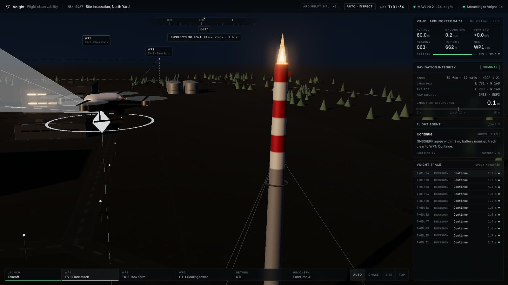
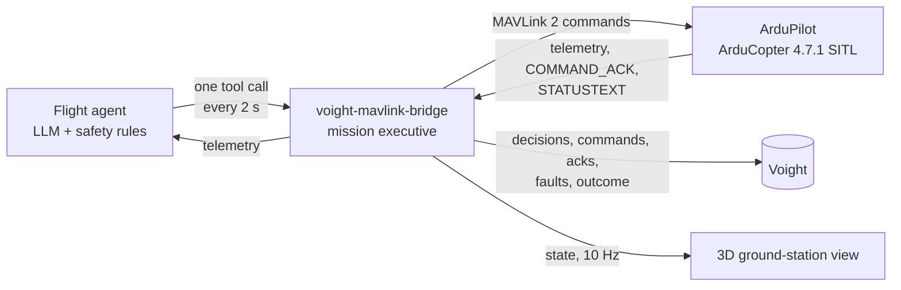
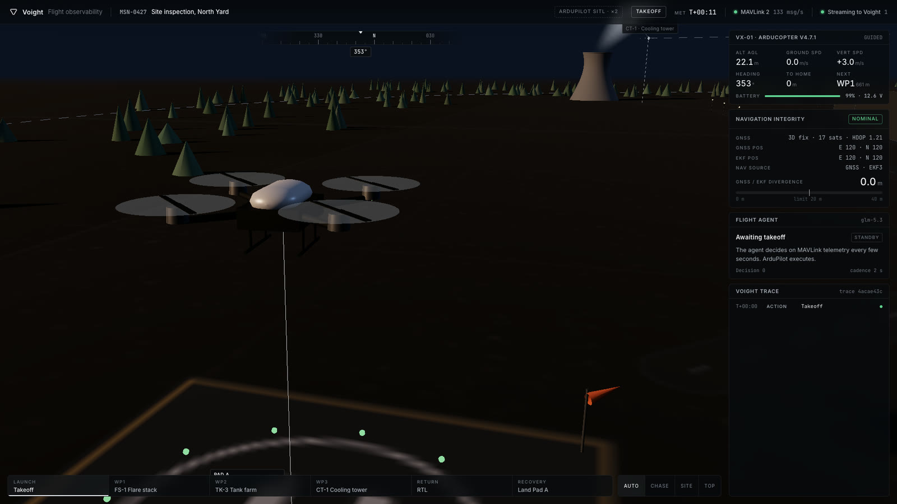
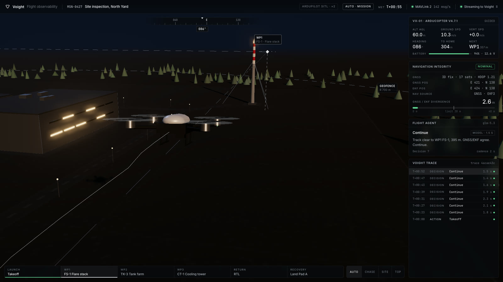
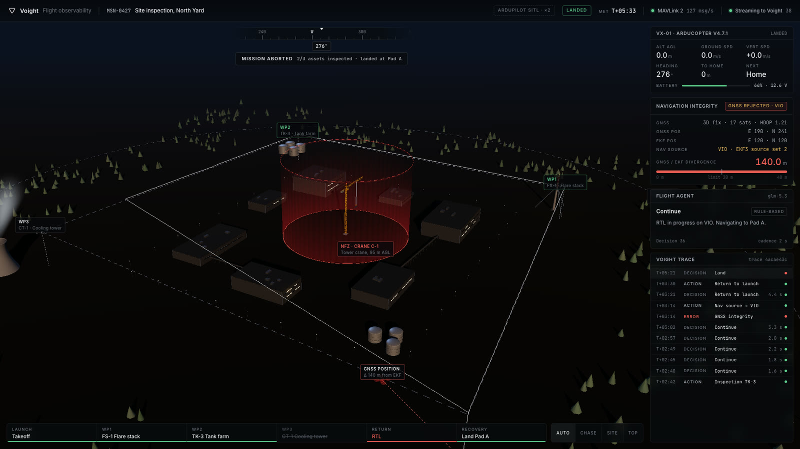

# Voight MAVLink bridge

[](LICENSE)
[](https://ardupilot.org)
[](https://mavlink.io)

An AI agent flies a real autopilot, and every decision it makes is observable.

ArduPilot flies the aircraft. A language-model agent decides what the aircraft should do next and talks to the autopilot over MAVLink. Every decision, every MAVLink command with the autopilot's acknowledgement, every inspection pass and every fault streams to [Voight](https://voight.xyz) as one trace, so a flight can be followed live, replayed and debugged like any other agent run.



## How it works



- **ArduPilot** runs in software-in-the-loop with its stock quadcopter physics and EKF3 navigation. Nothing in the flight dynamics or the state estimation is simulated by this project.
- **The bridge** connects on `tcp:5760`, asks for the telemetry it needs, and runs a mission executive: GUIDED position targets for each leg, an inspection pass on station at each asset with the nose on the asset, a detour if the crane no-fly zone is on the track, RTL at the end.
- **The agent** reads the MAVLink telemetry every 2 seconds and calls one tool: `set_heading`, `set_altitude`, `hold`, `return_to_base` or `continue`. Any OpenAI-compatible model works. Deterministic safety rules compute the safe answer in parallel and override the model when a rule is at stake; the override is recorded in the trace.
- **Voight** receives one event per decision, command, inspection, fault and outcome, all sharing one trace id per mission.

## The mission

MSN-0427, site inspection: flare stack FS-1, tank farm TK-3 and cooling tower CT-1 at 60 m, keeping clear of tower crane C-1, then back to Pad A.

<table>
  <tr>
    <td width="50%" valign="top"><br /><sub><b>Takeoff.</b> Armed in GUIDED and launched to 60 m with <code>MAV_CMD_COMPONENT_ARM_DISARM</code> and <code>MAV_CMD_NAV_TAKEOFF</code>, both acknowledged by the autopilot.</sub></td>
    <td width="50%" valign="top"><br /><sub><b>Cruise.</b> The executive sends <code>SET_POSITION_TARGET_GLOBAL_INT</code>; the agent checks GNSS against the EKF estimate on every decision.</sub></td>
  </tr>
  <tr>
    <td width="50%" valign="top"><br /><sub><b>Inspection pass.</b> On station at FS-1 with the camera on the flare stack; the pass is recorded as an <code>inspect_asset</code> action with its time on station.</sub></td>
    <td width="50%" valign="top"><br /><sub><b>Back on Pad A.</b> The site after an aborted mission: two of three assets inspected, landed 0 m from the pad.</sub></td>
  </tr>
</table>

## GNSS spoofing, detected and handled

At 60% of the mission a spoofing attack is staged in the simulator with ArduPilot's own `SIM_GPS1_GLTCH` parameters. The receiver keeps reporting a healthy 3D fix with 17 satellites while its position walks away from the truth at 4 m/s. What happened in the recorded flight:

1. **T+188.8 s.** The reported GNSS position starts to drift.
2. **T+191.2 s.** EKF3 starts rejecting the GNSS position and ArduPilot reports *"GPS Glitch or Compass error"*. The receiver still shows 17 satellites and HDOP 1.21.
3. **T+194.4 s.** The bridge's integrity monitor sees the GNSS position 20.4 m away from the EKF estimate (EKF3 innovation test ratio 4.58), above the 20 m limit. In the same tick it switches EKF3 to source set 2, visual-inertial odometry, with `MAV_CMD_SET_EKF_SOURCE_SET`. ArduPilot answers `ACCEPTED` and stops fusing GNSS.
4. **Next decision.** The agent, the model on its own with no override, calls `return_to_base`: *"GNSS/EKF divergence 49.8 m exceeds 20 m; VIO active. Rule requires immediate RTL."* `MAV_CMD_DO_SET_MODE` RTL, `ACCEPTED`.
5. **Landing.** The aircraft flies home on VIO and lands on the pad with 66% battery while the spoofed GNSS position is 140 m away.

Why the monitor has to act fast: once EKF3 has rejected the GNSS position for 10 seconds while still fusing GNSS velocity, it resets its position to the GNSS measurement, by design, to recover from real glitches. Under a spoofing attack that reset anchors the vehicle on the false position, and from then on the autopilot navigates confidently to the wrong place. Catching the divergence before that timeout, and moving navigation to a source the attacker does not control, is what keeps the aircraft where it believes it is.

What the trace shows, in order:

```
ERROR     GNSS integrity: receiver position diverged from the EKF estimate beyond 20 m. GNSS rejected.
ACTION    reject_gnss       MAV_CMD_SET_EKF_SOURCE_SET 2        ACCEPTED
DECISION  return_to_base    glm-5.3, no override
ACTION    return_to_base    MAV_CMD_DO_SET_MODE RTL             ACCEPTED
DECISION  land              Mission aborted on GNSS spoofing. Landed at Pad A on VIO navigation.
```

## Events sent to Voight

| Event | Type | Contents |
| --- | --- | --- |
| Takeoff | `action` | arm and takeoff commands with their acknowledgements |
| Each decision | `decision` | the telemetry the agent saw, its rationale, the tool it chose, model, tokens, whether the safety rules overrode it |
| Each executed command | `action` | the MAVLink messages sent and the autopilot's answer |
| Each inspection pass | `action` | `inspect_asset` with the asset and the time on station |
| GNSS spoofing | `error` | divergence, satellites and HDOP at detection, EKF3 innovation ratio, the autopilot's own messages |
| Navigation switch | `action` | `reject_gnss`: EKF source set 2 and its acknowledgement |
| Landing | `decision` | outcome, assets inspected, distance from the pad, battery |

All events of a mission share `metadata.traceId` and carry the telemetry snapshot in `metadata.telemetry`. The error message is stable across flights, so every flight with this fault lands in the same issue.

## Run it

**Requirements:** Node 20 or later, and ArduPilot built for SITL once (about two minutes on Apple silicon). No Gazebo, no MAVProxy, no Docker.

```bash
git clone --depth 1 --branch Copter-4.7.1 https://github.com/ArduPilot/ardupilot.git ~/ardupilot
cd ~/ardupilot
git submodule update --init --depth 1 --recursive modules/waf modules/mavlink modules/littlefs modules/lwip \
  modules/DroneCAN/DSDL modules/DroneCAN/dronecan_dsdlc modules/DroneCAN/libcanard modules/DroneCAN/pydronecan
python3 -m venv ~/.venvs/ardupilot-sitl
~/.venvs/ardupilot-sitl/bin/pip install setuptools future empy==3.3.4 pexpect dronecan pymavlink
PATH="$HOME/.venvs/ardupilot-sitl/bin:$PATH" ./waf configure --board sitl
PATH="$HOME/.venvs/ardupilot-sitl/bin:$PATH" ./waf copter
```

**Then, in this repository:**

```bash
npm install
cp .env.example .env   # VOIGHT_API_KEY, LLM_API_KEY, AGENT_MODEL
npm run demo
```

`npm run demo` starts ArduCopter SITL (log in `.sitl/sitl.log`), connects to it and flies the mission. Open http://localhost:4200 for the ground-station view next to the Voight dashboard. Keys: `1` auto camera, `2` chase, `3` site, `4` top, `H` hides the camera control. `GET /restart` starts a new mission with a new trace once the aircraft has landed.

Without keys the bridge prints the events instead of sending them, and the rule-based agent flies alone. `SITL=external` connects to a SITL, or a vehicle on a TCP link, that is already running. `FAULT=none` flies the mission without the attack. All options are in [`.env.example`](.env.example).

## Where the numbers come from

Everything the agent and the panels read comes from MAVLink, as a ground station would receive it: `GLOBAL_POSITION_INT` (EKF estimate), `GPS_RAW_INT` (receiver), `EKF_STATUS_REPORT`, `VFR_HUD`, `SYS_STATUS`, `WIND`, `HEARTBEAT`, `STATUSTEXT`, `COMMAND_ACK`, `AUTOPILOT_VERSION`. The one exception is the 3D view, which draws the aircraft at the simulator's true position (`SIMSTATE`) so the gap between truth, EKF and GNSS can be seen. The site is drawn in local metres with Pad A on the vehicle's home, at ArduPilot's standard SITL field.

## Project layout

| Path | What it does |
| --- | --- |
| `src/mav.ts` | MAVLink 2 link with the ArduPilot dialect; commands wait for their `COMMAND_ACK` |
| `src/vehicle.ts` | mission executive and telemetry snapshot |
| `src/agent.ts` | LLM agent and safety rules |
| `src/main.ts` | integrity monitor, decision loop, Voight events |
| `src/spoof.ts` | the staged GNSS spoofing attack (test harness, not part of the vehicle) |
| `src/sitl.ts` | starts ArduCopter SITL |
| `sitl/voight.parm` | vehicle parameters on top of ArduPilot's copter defaults: speeds, battery, EKF source set 2 for VIO |
| `public/index.html` | 3D ground-station view (Three.js); `?replay` renders a recorded flight frame by frame |

## License

Apache License 2.0, see [LICENSE](LICENSE).

ArduPilot (GPLv3) is not included or modified: it runs as a separate process and the bridge talks to it over MAVLink. `node-mavlink` and `mavlink-mappings` (LGPL-3.0) are installed as npm dependencies. Three.js (MIT) is loaded from a CDN.

Built by [Voight](https://voight.xyz), observability and debugging for AI agents. Documentation at [docs.voight.xyz](https://docs.voight.xyz).
